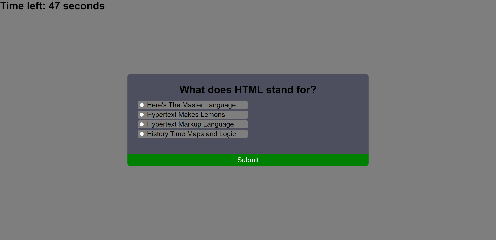

# Code Quiz Challenge

## Description

I was given the task of building a quiz webpage to test the user's JavaScript knowledge. The expectations were to have a multiiple choice quiz with a timer that decreases with each incorrect answer selected. When the quiz is finished, an option is to be given to save the user's initials and score.

## Website Links

- Deployed URL: https://blakeedwards3.github.io/code-quiz-challenge/
- GitHub Repository: https://github.com/blakeedwards3/code-quiz-challenge

## Website Screenshot

## Credits

Here is a list of the main resources I used to make my page work when I got stuck:

- https://developer.mozilla.org/en-US/docs/Web/CSS/cursor
- https://developer.mozilla.org/en-US/docs/Web/HTML/Element/input/radio
- https://developer.mozilla.org/en-US/docs/Web/HTML/Element/input
